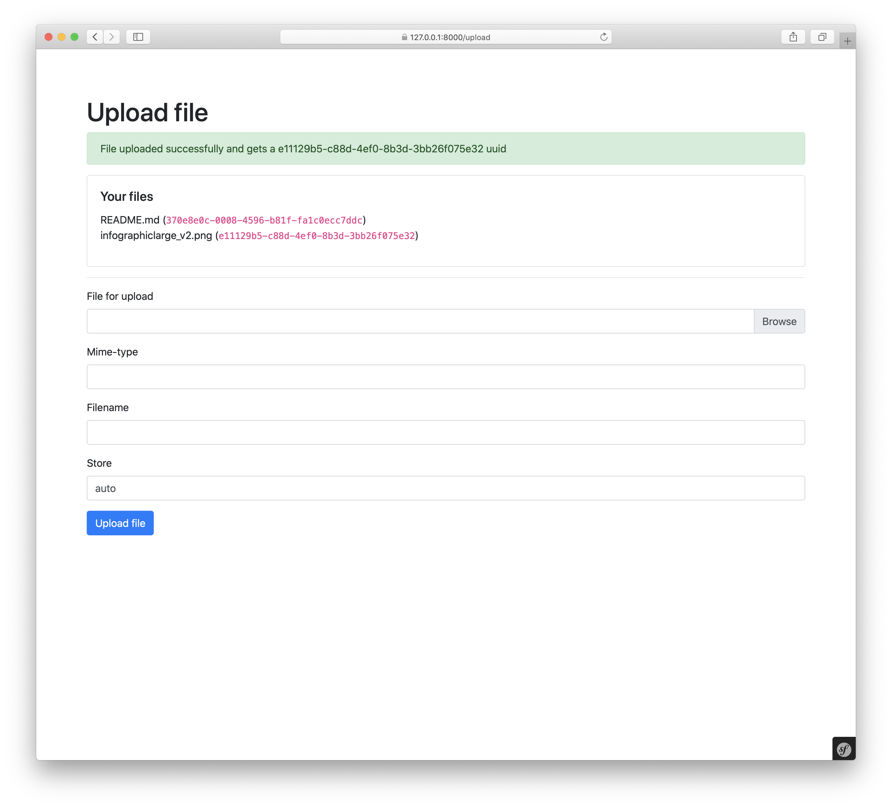

Example project for Uploadcare-php client
=========================================

This is example project for demonstration of [uploadcare-php](https://github.com/uploadcare/uploadcare-php) possibilities.

An example project based on Symfony Framework, but the library itself can be used in any PHP environment. 

## Table of contents

- [Demo-project installation](#install-demo-project)
- [Container initialization](#container-initialization)
- [Direct initialization](#direct-initialization)
- [Upload file from console](#upload-file)
- [Get files list and file info](#files-and-file-info)
- [Example of store file](#store-file)
- [Example of delete file](#delete-file)
- [Batch store files](#batch-store-files)
- [Batch delete files](#batch-delete-files)
- [Create group of files](#create-group)
- [List of file groups](#list-of-file-groups)
- [Group info](#group-info)
- [Project info](#project-info)
- [List of project webhooks](#list-of-webhooks)
- [Create webhook](#create-webhook)
- [Update webhook](#update-webhook)
- [Delete webhook](#delete-webhook)
- [Conversion operations](#conversion-operations)
    - [Convert document](#convert-documen)
    - [Get document conversion job status](#document-conversion-status)
    - [Convert video](#convert-video)
    - [Video conversion job status](#video-conversion-status)

## Install demo-project

Requirements:

- php7.4
- ext-ctype
- ext-iconv
- ext-curl

### Installation

- Clone this repository;
- Run `composer install` from project root;
- See examples

## Container initialization

### Symfony-container example:

```yaml
parameters:
    uploadcare_public_key: '%env(UPLOADCARE_PUBLIC_KEY)%'
    uploadcare_private_key: '%env(UPLOADCARE_PRIVATE_KEY)%'

services:
    Uploadcare\Interfaces\ConfigurationInterface:
        class: Uploadcare\Configuration
        factory: ['Uploadcare\Configuration', 'create']
        arguments: ['%uploadcare_public_key%', '%uploadcare_private_key%']

    uploadcare.configuration:
        alias: 'Uploadcare\Interfaces\ConfigurationInterface'

    Uploadcare\Api:
        arguments:
            - '@uploadcare.configuration'
```

See working example in [`config/services.yaml`](config/services.yaml)

### Laravel-container example

```php
// config/uploadcare.php
return [
    'uploadcare_public_key' => env('UPLOADCARE_PUBLIC_KEY'),
    'uploadcare_private_key' => env('UPLOADCARE_PRIVATE_KEY'),
];
```

```php
// app/providers/UploadcareServiceProvider.php
namespace App\Providers;

use Illuminate\Foundation\Application;
use Illuminate\Support\ServiceProvider;
use Uploadcare\Api;
use Uploadcare\Configuration;
use Uploadcare\Interfaces\ConfigurationInterface;

class UploadcareProvider extends ServiceProvider
{
    public function register()
    {
        $this->app->bind(ConfigurationInterface::class, function () {
            return Configuration::create(config('uploadcare.public_key'), config('uploadcare.private_key'));
        });

        $this->app->bind(Api::class, function (Application $app) {
            return new Api($app->get(ConfigurationInterface::class));
        });
    }
}
```

## Direct initialization

Define variables or constants with Uploadcare public and private keys:

```php
(new \Symfony\Component\Dotenv\Dotenv())->bootEnv(__DIR__ . '/.env');

// Or something like that
defined('UPLOADCARE_PUBLIC_KEY') or define('UPLOADCARE_PUBLIC_KEY', '<Your public key>');
defined('UPLOADCARE_PRIVATE_KEY') or define('UPLOADCARE_PRIVATE_KEY', '<Your private key>');
```

Make configuration object and API instance:

```php
$configuration = \Uploadcare\Configuration::create($_ENV['UPLOADCARE_PUBLIC_KEY'], $_ENV['UPLOADCARE_PRIVATE_KEY']);
$api = new \Uploadcare\Api($configuration);
```

Or make API instance with factory:

```php
$api = \Uploadcare\Api::create($_ENV['UPLOADCARE_PUBLIC_KEY'], $_ENV['UPLOADCARE_PRIVATE_KEY']);
```

### Upload file

### Console usage example

See `App\Command\UploadFileCommand` (`src/Command/UploadFileCommand.php`);

There is a different ways for upload files — from file path, from resource, created by `\fopen()` function of `SplFileObject` implementation, from remote url or from string contents.

All those ways implemented in example command.

Run command as `bin/console app:upload-file /path/to/file`.

See `app:upload-file --help` for information and run examples.

### Web usage example

See `App\Controller\UploadController` for controller example and `templates/upload/index.html.twig` for template markup.

In this example you can see the way to organize upload operations for user web-interface. Most of web-services restricts the upload size, and this is a simple example with one-piece uploading with size restricted by the server. 

Steps to run example:

- run development web-server ([Symfony CLI](https://symfony.com/download) or whatever you prefer);
- open `https://localhost:8000/upload` page in your preferred browser;
- upload file and see the result


