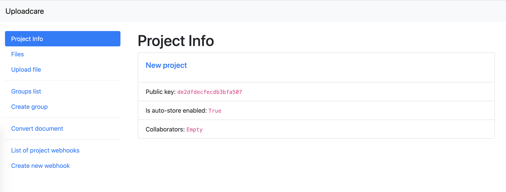
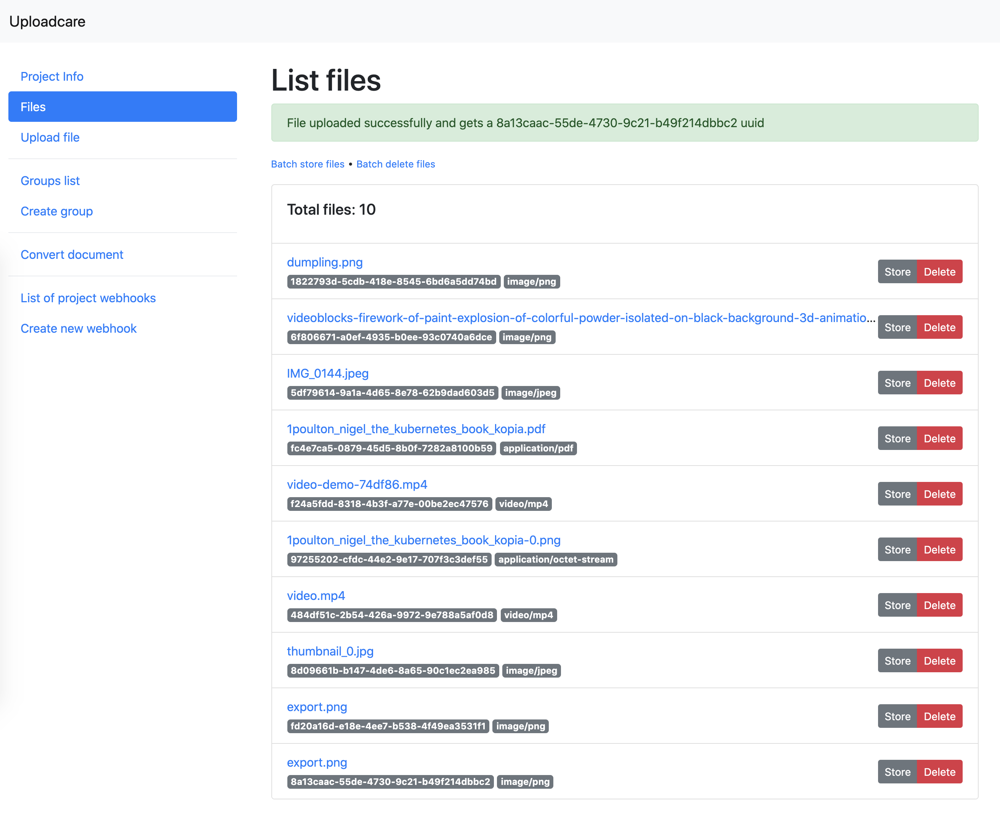
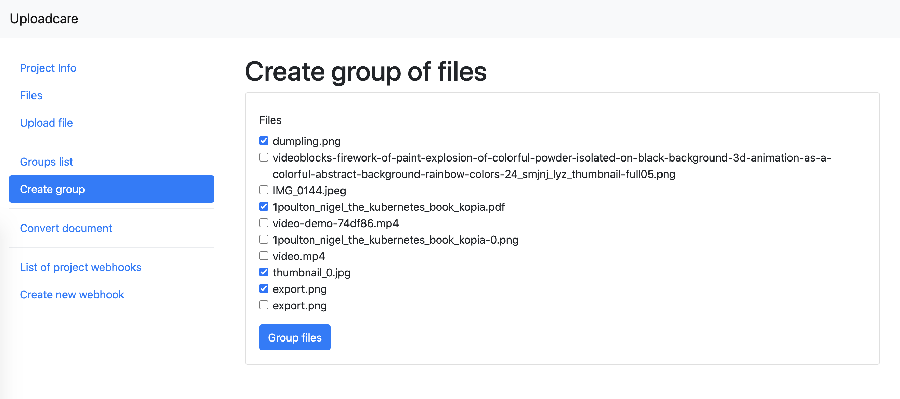
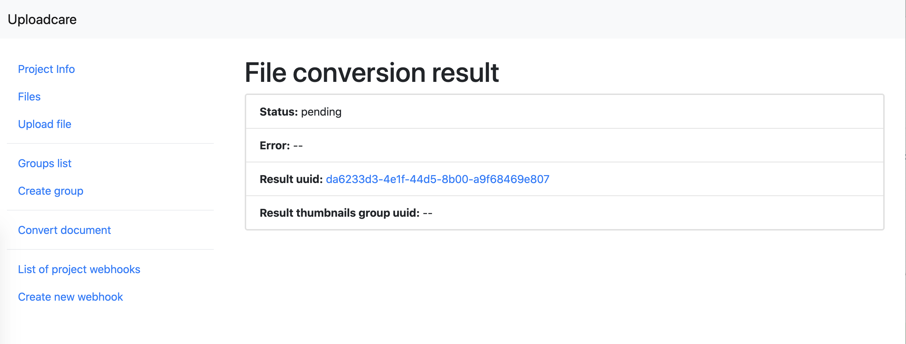
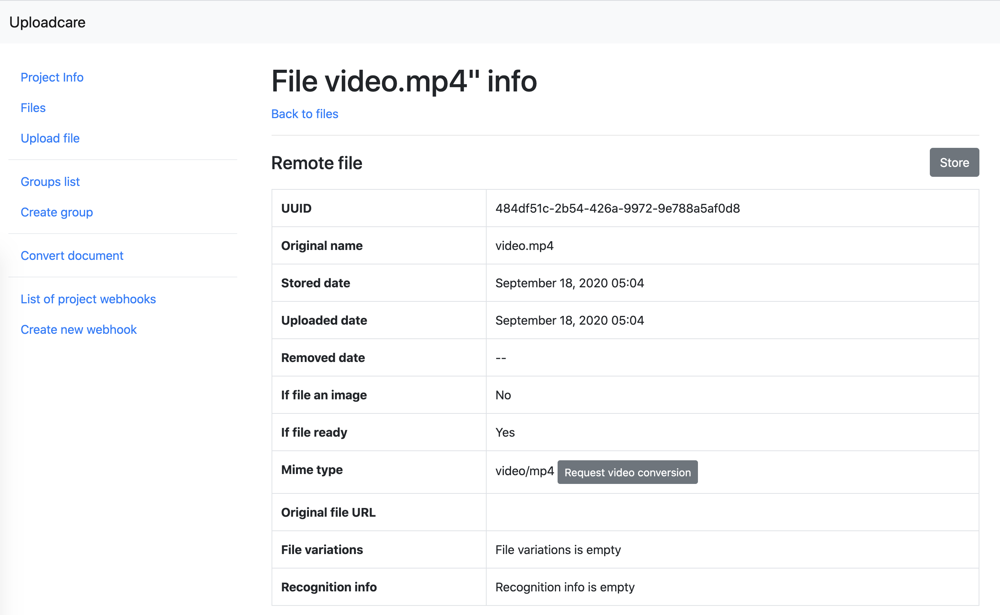
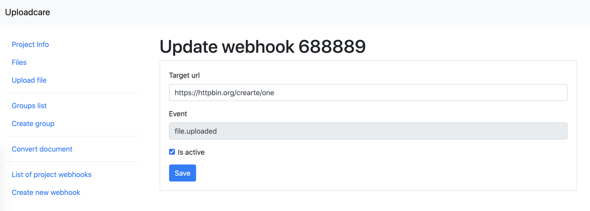

Example project for Uploadcare-php client
=========================================

This example project demonstrates the [uploadcare-php](https://github.com/uploadcare/uploadcare-php) capabilities.

The project is based on the Symfony Framework, and the library can be used in any PHP environment on its own.

## Table of contents

- [Demo-project installation](#install-demo-project)
- [Container initialization](#container-initialization)
- [Direct initialization](#direct-initialization)
- [Project info](#project-info)
- [File operations](#file-operations)
    - [Upload file](#upload-file)
    - [Get files list and file info](#files-and-file-info)
    - [Example of store file](#store-file)
    - [Example of delete file](#delete-file)
    - [Batch store files](#batch-store-files)
    - [Batch delete files](#batch-delete-files)
- [Group operations](#group-operations)
    - [Create group of files](#create-group)
- [Conversion operations](#conversion-operations)
    - [Convert document](#convert-document)
    - [Get document conversion job status](#document-conversion-status)
    - [Convert video](#convert-video)
    - [Video conversion job status](#video-conversion-status)
- [Webhook operations](#webhook-operations)
    - [List of project webhooks](#list-of-webhooks)
    - [Create webhook](#create-webhook)
    - [Update webhook](#update-webhook)
    - [Delete webhook](#delete-webhook)

## Usage with Docker

Docker is an easy option to run this project in a package. Here’s how to deploy this demo project with Docker.

1. Clone this repository and build a Docker image:

```shell script
docker build -t uploadcare-example-project -f Dockerfile .
```

2. Run the image:

```shell script
docker run -it --rm -p 8000:8000 -e UPLOADCARE_PUBLIC_KEY=<your public key> -e UPLOADCARE_SECRET_KEY=<your secret key> uploadcare-example-project sh
```

3. Install composer packages (`composer install`) in the container shell and run a simple dev-server:

`php -S 0.0.0.0:8000 public/index.php`

4. Open the project’s web-interface in your web browser locally:

`http://localhost:8000`.

## Install demo-project

Requirements:

- php 8.1
- ext-ctype
- ext-iconv
- ext-curl

First steps:

1. Clone this repository.
2. Run `composer install` from project's root.
3. Check out examples.

## Container initialization

### Symfony-container example

```yaml
parameters:
    uploadcare_public_key: '%env(UPLOADCARE_PUBLIC_KEY)%'
    uploadcare_secret_key: '%env(UPLOADCARE_SECRET_KEY)%'

services:
    Uploadcare\Interfaces\ConfigurationInterface:
        class: Uploadcare\Configuration
        factory: ['Uploadcare\Configuration', 'create']
        arguments: ['%uploadcare_public_key%', '%uploadcare_secret_key%']

    uploadcare.configuration:
        alias: 'Uploadcare\Interfaces\ConfigurationInterface'

    Uploadcare\Api:
        arguments:
            - '@uploadcare.configuration'
```

See working example in [`config/services.yaml`](config/services.yaml)

### Laravel-container example

```php
// config/uploadcare.php
return [
    'uploadcare_public_key' => env('UPLOADCARE_PUBLIC_KEY'),
    'UPLOADCARE_SECRET_KEY' => env('UPLOADCARE_SECRET_KEY'),
];
```

```php
// app/providers/UploadcareServiceProvider.php
namespace App\Providers;

use Illuminate\Foundation\Application;
use Illuminate\Support\ServiceProvider;
use Uploadcare\Api;
use Uploadcare\Configuration;
use Uploadcare\Interfaces\ConfigurationInterface;

class UploadcareProvider extends ServiceProvider
{
    public function register()
    {
        $this->app->bind(ConfigurationInterface::class, function () {
            return Configuration::create(config('uploadcare.public_key'), config('uploadcare.secret_key'));
        });

        $this->app->bind(Api::class, function (Application $app) {
            return new Api($app->get(ConfigurationInterface::class));
        });
    }
}
```

## Direct initialization

Define variables or constants with Uploadcare public and secret keys:

```php
(new \Symfony\Component\Dotenv\Dotenv())->bootEnv(__DIR__ . '/.env');

// Or something like that
defined('UPLOADCARE_PUBLIC_KEY') or define('UPLOADCARE_PUBLIC_KEY', '<Your public key>');
defined('UPLOADCARE_SECRET_KEY') or define('UPLOADCARE_SECRET_KEY', '<Your secret key>');
```

Make a configuration object and API instance:

```php
$configuration = \Uploadcare\Configuration::create($_ENV['UPLOADCARE_PUBLIC_KEY'], $_ENV['UPLOADCARE_SECRET_KEY']);
$api = new \Uploadcare\Api($configuration);
```

Or make an API instance with factory:

```php
$api = \Uploadcare\Api::create($_ENV['UPLOADCARE_PUBLIC_KEY'], $_ENV['UPLOADCARE_SECRET_KEY']);
```

## Common information

All web-examples are accessible with a development web-server by [Symfony CLI](https://symfony.com/download).

## Project info

You can get the project information by its public key.

[Console example](src/Command/ProjectInfoCommand.php), [Web example](src/Controller/ProjectInfoController.php). The web example sits in the `/` (root) directory.



## File operations

### Upload file

### Console usage example

See `App\Command\UploadFileCommand` (`src/Command/UploadFileCommand.php`);

There are a few ways to upload files. You can upload files from a file path, a resource created by `\fopen()` function of the `SplFileObject` implementation, from a remote URL, and from the string contents.

All these uploading options are supported as console commands. For example, this command will upload a file from the path:

`bin/console app:upload-file /path/to/file`

Read help to learn more about other parameters:

`app:upload-file --help`

### Web usage example

Check out the controller example `App\Controller\UploadController` and the markup template `templates/upload/index.html.twig`.

This example shows upload operations in the web UI. Most web-services provide an option to limit the uploading file size. In this simple example, you’ll limit the file size on a server, and can perform one-piece uploading.

Steps to run:

1. Open `https://localhost:8000/upload` in your web browser.
2. Select a file to upload and then see how it’s uploaded.

### Files and file info

If you have files in your project, you can see them in the `/file-list` directory or by using a a`pp:file-info [file-id]` command. There are console examples in `src/Command/FileInfoCommand.php` and web examples in the `src/Controller/FileInfoController.php`



## Store file

This option makes sense when you upload a file with the `store` field option set to `0`. Anyway, you can call the `store` method on any file. See examples in `StoreFileController`.

Please, remember that your files **will be deleted** after 24 hours in case you not store them and your project has not "Auto store" option.

## Delete file

You can delete any file from the `file-info` screen. Find examples in `DeleteFileController`.

## Batch store files

You can apply the Store operation for all files or for selected files. Look at `/batch-store` and `BatchStoreController` for examples.

## Batch delete files

You can delete all files or selected files with a batch delete operation. See `/batch-delete` and `BatchDeleteController` for examples.

## Group operations

You can see your groups of files in `/groups` ("Group list" menu item). You can go deeper and see the group info by clicking the to group ID in the list. Find examples in `GroupController::index` and `GroupController::info`.

## Create group

You can see your file list In the `/group-create` directory ("Create group" menu item). Also, you can select files and create a group. Find examples in `GroupController::createGroup`.



After creating a group, your browser will redirect to the /group-info page.

## Conversion operations

Uploadcare API provides options to convert documents (DOCs, PDFs, etc.) and video-files to various formats. See [Document Conversion](https://uploadcare.com/docs/transformations/document_conversion/) and [Video Encoding](https://uploadcare.com/docs/transformations/video_encoding/) documentation.

In this library, you don’t need to create the conversion URLs manually, and just create a special object for each conversion (document or video) and use it through the library API.

### Convert document

To convert a document from one format to another, create `Uploadcare\Conversion\DocumentConversionRequest` and set it as a target data. For example:

```php
$configuration = \Uploadcare\Configuration::create($_ENV['UPLOADCARE_PUBLIC_KEY'], $_ENV['UPLOADCARE_SECRET_KEY']);
$api = new \Uploadcare\Api($configuration);
$dcr = (new Uploadcare\Conversion\DocumentConversionRequest())
    ->setTargetFormat('png')
    ->setStore(true)
    ->setThrowError(false)
    ->setPageNumber(2);
$file = $api->file()->fileInfo('1822793d-5cdb-418e-8545-6bd6a5dd74bd');

$result = $api->conversion()->convertDocument($file, $dcr);
```

In this case, we take a PDF file and convert its second page to a PNG image. The $result variable will contain either:

- `Uploadcare\Interfaces\Conversion\ConvertedItemInterface` if everything is okay.
- `Uploadcare\Interfaces\Response\ResponseProblemInterface` in case the conversion cannot be done, or your account plan doesn’t support the document conversion.

`ConvertedItemInterface` contains UUID of the converted document and a token, that can be used in a conversion status request.

If you pass `true` to the `setThrowError` method of `DocumentConversionRequest`, any conversion problem will throw `Uploadcare\Exception\ConversionException`. Otherwise, the response will contain `ResponseProblemInterface`.
Examples can be found in `/convert-document` ("Convert Document" menu item), and the code examples in `DocumentConversionController`

### Document Conversion Status

After the document is converted successfully, you’ll be redirected to the Document conversion status page:



See the code example in `DocumentConversionController::conversionResult`.

### Convert video

To create a video conversion request, make the `Uploadcare\Conversion\VideoEncodingRequest` and add request data to it. See [Video Encoding](https://uploadcare.com/docs/transformations/video_encoding/) documentation for the detailed description and `Uploadcare\Interfaces\Conversion\VideoEncodingRequestInterface` for library API options.

For example, you can request converting a video file to the WebM format, resize it to 720px in width, while preserving the aspect ratio, compress the file and store it:

```php
$configuration = \Uploadcare\Configuration::create($_ENV['UPLOADCARE_PUBLIC_KEY'], $_ENV['UPLOADCARE_SECRET_KEY']);
$api = new \Uploadcare\Api($configuration);
$ver = (new \Uploadcare\Conversion\VideoEncodingRequest())
    ->setTargetFormat('webm')
    ->setHorizontalSize(720)
    ->setResizeMode('preserve_ratio')
    ->setQuality('lightest')
    ->setStore(true);
$file = $api->file()->fileInfo('f24a5fdd-8318-4b3f-a77e-00be2ec47576');

$result = $api->conversion()->convertVideo($file, $ver);
```

You can also trim the video by setting start and end time in `H:MM:SS.sss` or `MM:SS.sss` formats.

The `$result` (as in document conversion) will contain either `ConvertedItemInterface` or `ResponseProblemInterface`.

You can see how it works by opening any video file info in the web UI and clicking the "Request video conversion" button.



See code examples in `VideoConversionController::conversionRequest`.

### Video Conversion Status

After the video is converted successfully, your browser will redirect to the Video conversion status page. This page looks like the Document conversion status, because the conversion status object implements the same interface.

## Webhook operations

Uploadcare [provides an option](https://uploadcare.com/docs/rest_api/webhooks/) to call any URL by the file uploading (webhooks). The library API provides methods to create, update and delete webhooks.

### List Of Webhooks

You can see the list of project webhooks in `/webhooks` ("List of project webhooks" menu item). Also, you can call the method `$api->webhook()->listWebhooks()` to get this list (`CollectionInterface` will be returned).

See code examples in `WebhooksController::index`.

### Create Webhook

The webhook creation runs in `/webhook-create` ("Create new webhook" menu item). You need to set the target URL to create a webhook.

See code examples in `WebhooksController::createWebhook`

### Update Webhook

You can click on "Update" button in the webhook list and get the update form. There, you can change the URL or a webhook’s event. See code examples in `WebhooksController::updateWebhook`.


    
### Delete Webhook

You can delete a webhook from a webhook list. Code examples in `WebhooksController::deleteWebhook`.
